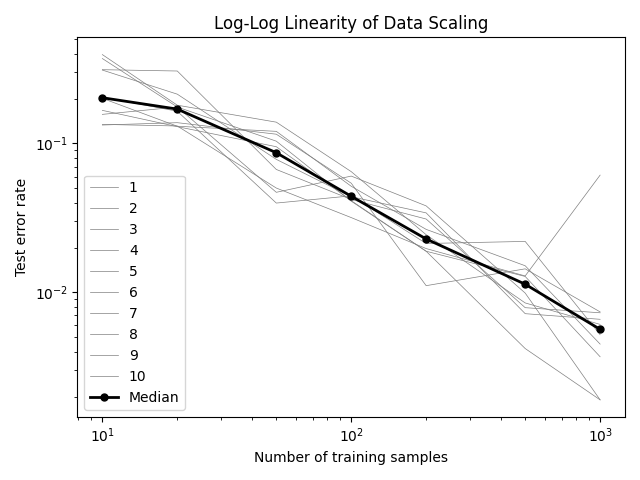

# `backprop` Repository Overview

# Repository Overview

This repository contains Python code to help understand basic concepts of deep learning through practical examples. It focuses on building simple neural networks from scratch using NumPy, a popular library for mathematical operations in Python.

## Features
- **Neural Network Basics**: Learn how neural networks work by building and training them to solve problems like the XOR classification.
- **Customizable Components**: Includes various components like activation functions (e.g., Sigmoid, ReLU) and loss functions (e.g., Mean Squared Error).
- **Data Scaling Analysis**: Explore how increasing training data affects model performance with scripts that plot error rates.

## How to Use
Run scripts to train models and see how changes affect results. For example, to train a neural network on XOR problem:
```bash
python train_xor.py
```
To analyze how more data improves accuracy:
```bash
python train_xor_data_scaling.py
```


## Data Scaling Analysis

Using the tools provided in this repo you can reproduce (data) scaling laws for neural networks. One prominent example is the [GPT-3 paper](https://arxiv.org/abs/2005.14165) where the validation loss scales with compute and model size. 

You can also find this relationship in speech recognition. There the WER per unique word scales with the word frequency in the training data.

On a much scaller scale, you can also reproduce this data scaling effect. `train_xor_data_scaling.py` trains a series of neural networks on the XOR problem with increasing amounts of training data (from 10 to 1000 samples). Each training is repeated 10 times.



In this log-log plot the median of the error rate (`1 - accuracy`) is plotted against the number of training samples.
As you can see in the plot the relationship is almost linear.

The single spike at $10^3$ is due to this beeing not a proper deep learning framework and is probably due to some training instability. If you re-run the experiment you might get a slightly different result.